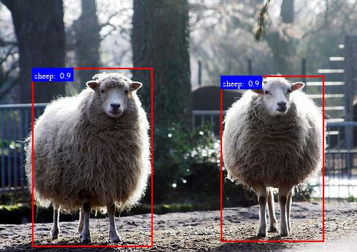

## my-faster-RCNN

本项目实现了带有 mobilenetv2, resnet50, 以及带有 fpn 结构的 resnet50 三种不同 backbone 的 Faster RCNN 目标检测算法。  

本项目的主要代码来源为 pytorch 官方 torchvision 仓库：[https://github.com/pytorch/vision/tree/main/torchvision/models/detection](https://github.com/pytorch/vision/tree/main/torchvision/models/detection)  

此外，项目还参考了仓库：[https://github.com/WZMIAOMIAO/deep-learning-for-image-processing](https://github.com/WZMIAOMIAO/deep-learning-for-image-processing)

## 运行环境

所依赖的包：  

lxml==4.9.1  
matplotlib==3.5.1  
numpy==1.21.5  
pycocotools==2.0.6  
tensorboard==2.10.1  
torch==1.12.1  
torchvision==0.13.1  
tqdm==4.64.1

python 版本 3.8 及以上。  

## 预训练权重和数据集下载

在训练模型之前，最好使用带有预训练权重的 backbone，可以使用 pytorch 官方在 ImageNet 训练集上的预训练权重。  

mobilenetV2 预训练权重下载地址：[https://download.pytorch.org/models/mobilenet_v2-b0353104.pth](https://download.pytorch.org/models/mobilenet_v2-b0353104.pth)  
下载之后需要放在项目 `backbones/`目录下，并将其重命名为:`mobilenet_v2.pth`

resnet50 预训练权重下载地址：[https://download.pytorch.org/models/resnet50-0676ba61.pth](https://download.pytorch.org/models/resnet50-0676ba61.pth)  
下载之后需要放在项目 `backbones/`目录下，并将其重命名为:`resnet50.pth`

训练数据集使用 Pascal VOC 数据集，数据集下载地址：[http://host.robots.ox.ac.uk/pascal/VOC/voc2012/VOCtrainval_11-May-2012.tar](http://host.robots.ox.ac.uk/pascal/VOC/voc2012/VOCtrainval_11-May-2012.tar)  
下载并解压完成之后放至项目`data/`目录下

## 训练模型
首先确保下载了相应数据集以及预训练权重。  

使用 mobilenetV2 作为 backbone 的模型，运行 train_mobilenetv2.py 文件即可训练。  

使用 resnet50 作为 backbone 的模型，运行 train_resnet50.py 文件即可训练。  

使用带有 fpn 结构的 resnet50 作为 backbone 的模型，运行 train_resnet50_fpn.py 文件即可训练。  

## 测试模型

predict.py 文件使用验证集对已经训练好的模型进行测试，并计算相应的指标，包括 mAP， Recall 等。在运行此文件之前，需要将文件中模型参数路径修改为你自己保存的模型参数路径。  

此外，该文件被注释的部分代码读取一张示例图片运行目标检测模型，绘制检测结果 bbox 并显示。(需要时反注释该段代码)

## 结果

对于使用 mobilenetV2 backbone 的模型，训练结果如下：  

```
backbone: mobilenet
 
Average Precision  (AP) @[ IoU=0.50:0.95 | area=   all | maxDets=100 ] = 0.303
Average Precision  (AP) @[ IoU=0.50      | area=   all | maxDets=100 ] = 0.618
Average Precision  (AP) @[ IoU=0.75      | area=   all | maxDets=100 ] = 0.259
Average Precision  (AP) @[ IoU=0.50:0.95 | area= small | maxDets=100 ] = 0.055
Average Precision  (AP) @[ IoU=0.50:0.95 | area=medium | maxDets=100 ] = 0.190
Average Precision  (AP) @[ IoU=0.50:0.95 | area= large | maxDets=100 ] = 0.357
Average Recall     (AR) @[ IoU=0.50:0.95 | area=   all | maxDets=  1 ] = 0.321
Average Recall     (AR) @[ IoU=0.50:0.95 | area=   all | maxDets= 10 ] = 0.442
Average Recall     (AR) @[ IoU=0.50:0.95 | area=   all | maxDets=100 ] = 0.449
Average Recall     (AR) @[ IoU=0.50:0.95 | area= small | maxDets=100 ] = 0.129
Average Recall     (AR) @[ IoU=0.50:0.96 | area=medium | maxDets=100 ] = 0.309
Average Recall     (AR) @[ IoU=1.50:0.95 | area= large | maxDets=100 ] = 0.512  
```

使用其它 backbone 训练时结果在 mobilenetV2 上有所提升，但提升不大(大概5，6个点，没有想象的那么好)，特别是带有 fpn 结构的 resnet50 作为骨干网络，估计是没有 fpn 部分的预训练权重，只有 resnet50 的权重导致。

示例图片检测结果如下：  

